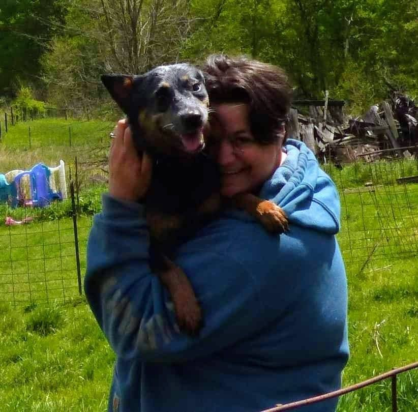

## Current Role

Mandy is currently an [ORISE Fellow](https://orise.orau.gov/about/index.html) with the at the U.S. Environmental Protection Agency (EPA) as a Soil Carbon Researcher. See the [Projects](agrichick45.github.io/Projects) page for more information

## About Me

Mandy is an artist trapped in the body of a scientist. Growing up in rural Wisconsin, she monitored several of the environmental impacts agriculture can have on the environment, and went on to study agricultural practices in college. She fell in love with soil science thanks to a charismatic, enthusiastic Scotsman on a study abroad trip in 2006-2007. She loved soil science so much, that she contacted the University of Minnesota and arranged a research opportunity with the USDA-ARS Water and Climate Unit. This project led to research in cover cropping, soil physical structure and nutrient use, and biochar. 

After graduation from her Undergraduate degree, she followed her soils passion to a soil fertility masters degree at Kansas State University. There, she fell in love with statistics and statistical applications. She continued that love at North Carolina State University, taking several geospatial data courses in many different software. In her free time, she reads about data science, machine learning methods, time series analysis, and applications of categorical data over space and time.

In her free time, she loved teaching about soils and food production to young, budding scientists. Because of her many years as a camp counselor and nature director for a few different Girl Scout Councils, Mandy is enthusiastic and adaptable, and has worked around many diverse crowds and audiences. Mandy also breeds and trains working Australian Cattle Dogs.

## Career Goals
Mandy currently spends a lot of her free time learning about statistics, data science, and GIS based technology, especially how this applies to rural development and the agricultural technology.  One day, she hopes to get a PhD, and work in the precision agricultural industry, optimizing economic return for the farmers, while minimizing the environmental footprint associated with feeding us all!

