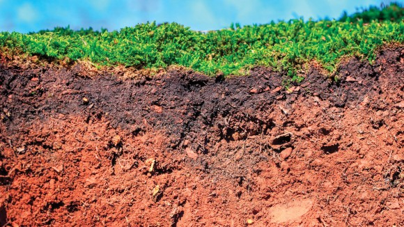
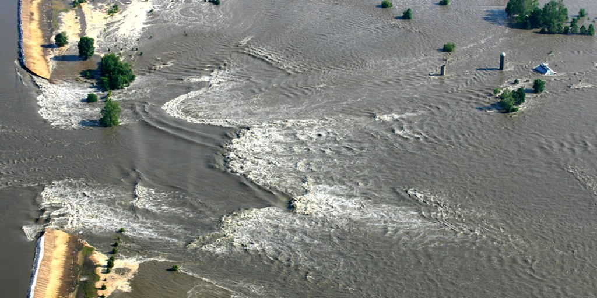
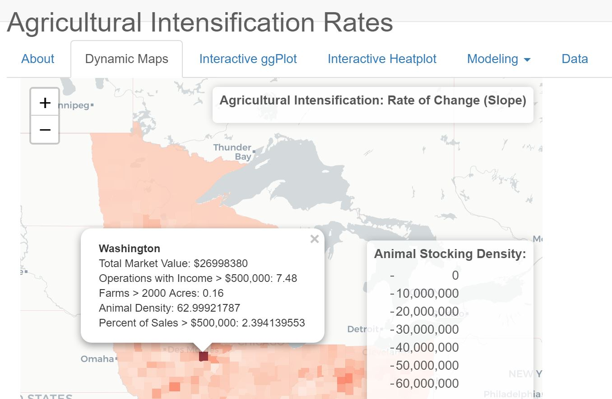
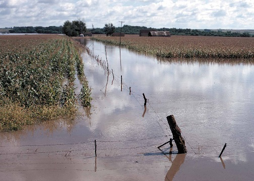

# Select Projects

This is a brief description of the major current projects: 

## EPA ORISE Fellowship: Soil Carbon Data
The project entails research related to greenhouse gas emissions from crop production, specifically focusing on soil carbon. This project involves analyzing existing soil carbon stock datasets and researching the state of knowledge related to soil carbon stocks and emissions. This position is in the Office of Transportation and Air Quality (OTAQ)  under the mentorship of Dr. Lauren Rafelski and Chris Ramig in the Climate Economics & Modeling Branch. 

I am working on improving to models using spatially explicit data (specifically soil carbon and vegetation). Right now, I am looking at the machine learning algorithms used in the 2020 release of [SoilGrids 2.0](https://soilgrids.org/) with a spatial resolution of 250 m. This involves figuring out, regionally, which covariates create the dominant sources of error (climate, ecosystems, geology, terrain, etc.)

This project involves manipulation and summarization of multiple large, global raster datasets. This is done using the terra package, raster reclassification, masking, clipping to polygons, and zonal statistics extraction, all summarized using dumbbell plots and tables in the Tidyverse in R (GET MARKDOWN DOCUMENT).

There are many other facets to this project that will follow with phase 1 completion, about Soil Carbon Stocks and Soil Carbon Stock error.  
Including:  
- Choosing which regions have the most dynamic carbon pools  (FIND AND LINK THE TUTORIAL)
- Improving the vegetation parameters from satellite images in these regions  

## Rural Risk and Environmental Justice in the Mississippi River Basin
There are many different definitions of risk, just like there are many different definitions of rural. Over the course of the summer I worked to aggregated over [500 columns of data](https://agrichick45.github.io/EDF/), from socio-economic indicators, medical health indicators, environmental quality, water availability, agricultural production dynamics, strength, population changes, job numbers, debt to asset ratios, and more.

#### Several projects came from this: 
This [ESRI Storymap](https://storymaps.arcgis.com/stories/3ec5284d3d60492e84c60e4b407df954) was a collaborative effort with Dana VanHuis (MS Student, University of Michigan) looks at how levees, flooding, impaired waters, animal density, and farmer debt to asset correlate with the Baseline Resilience Indicators for Communities [(BRIC)](https://experience.arcgis.com/experience/376770c1113943b6b5f6b58ff1c2fb5c/page/page_8/), which uses socio-economic data to figure in disaster resilience.

Another Risk indicator looked at the [agricultural makeup](https://agrichick45.github.io/RuralRisk/AgDiver.html) and diversity of rural counties, using hierarchical clustering algorithms. This project evolved into a shiny app (under review on publication options) allowing for interactive selection of some key variables behind agricultural intensification, and dynamic visualizations with maps, interactive ggplots, and heatmaps of key variables and drivers for areas experiencing heavy intensification. This project also focused on integrating several dynamic machine learning algorithms

A fall project looked at [The Dark Underbelly](https://agrichick45.github.io/RuralRisk/DarkRisk.html) of rural America, focusing on lost identity, the tenants of the True Believer, and how our economic system created three major catalysts toward fundamentalism: The New Poor, Frustration, and Passionate Hatred. (Content warning, contains conversations about assault, deaths of despair)

## Optimizing Nitrogen Reduction with Wetland Restoration

The United States Corn belt Nitrogen from the Upper Mississippi River Basin provide nearly 40% of the nitrogen pollution to the Gulf of Mexico, with Iowa being the first or second biggest contributor the toxic dead zone in the Gulf of Mexico. Despite years of work in extension, cropping practice change, and concerted efforts on the parts of farmers and government officials alike, there does not seem to be any overall improvement in overall nitrogen loss. [Results](https://sites.google.com/ncsu.edu/mandysportfolio/home/capstone-experience) are in my MGIST Portfolio.

