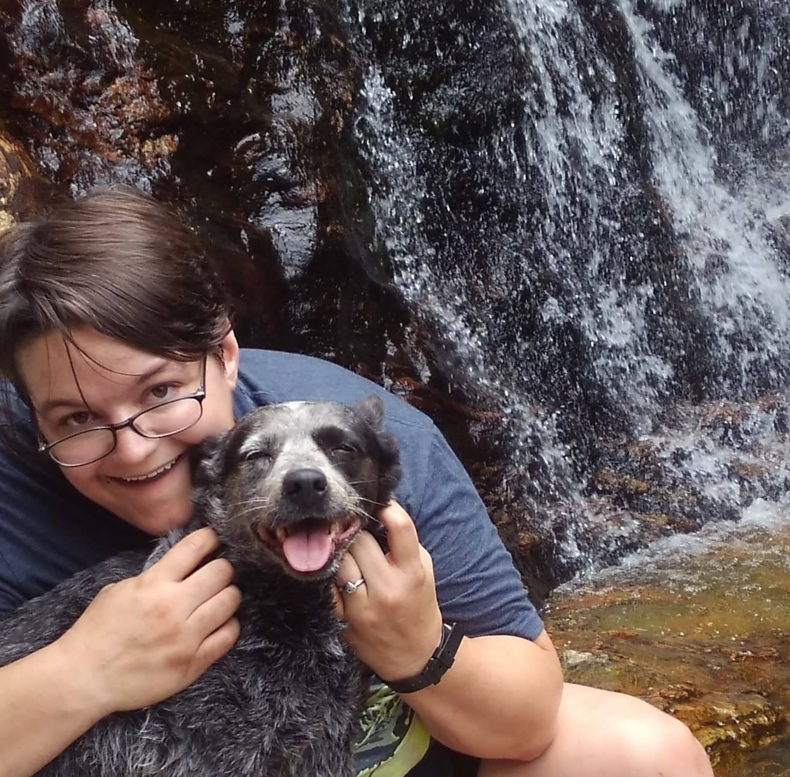

An aspiring big and messy data GIS scientist in the making, with a focus on all things rural, this is the Github Page for Mandy Liesch featuring several data science and visualization projects.  There are several different projects, each focusing on a different analysis and skillset. Skill sets feature anything from visualizations, to  database management, to machine learning and processing of messy datasets. These are done with several different softwares. 

Major Topics Include:  
- Big data cleaning and manipulation  
- Automating API processing
- Statistical Interpolation  
- Time-Series Raster Analysis  
- Statistical Machine Learning  
- Satellite Imagery Manipulation  
- 3D and T Volume Analysis  
- Large Scale Raster Processing  

Softwares Include: 
- R
- GRASS GIS  
- ArcMap  and ArcPro  
- ArcGIS Online  
- Python  

More information on Mandy and her history can be found by exploring the navigation tabs. 

## Follow Me: 
 [Github](https://github.com/agrichick45)  [LinkedIn](https://www.linkedin.com/in/mandy-liesch-a38a5147/)
