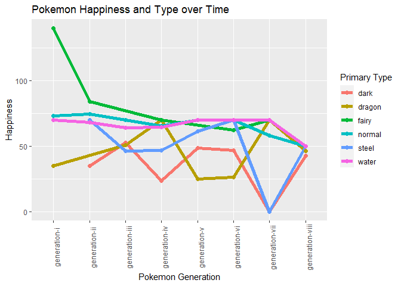

## Skillset Section for Data Scientists
Based off a [Top 6 Data Science Skills for 2022](https://www.simplilearn.com/what-skills-do-i-need-to-become-a-data-scientist-article) article, major areas that data scientists need to show proficiency in, as well as the subsequent projects I have worked on to get these skills.

This page is a work in progress, as I pull in many different projects, and reconfiguring them to Github Vignettes and Code.

- Statistical Analysis
- Machine Learning
- Big Data
- Data Visualization
- Data Wrangling
- Programming

### [The Upcoming Pokemon Crisis Vignette](https://agrichick45.github.io/ST558Project1/)
This [project](https://agrichick45.github.io/ST558Project1/) taps into every single data science category mentioned above. Using the [Pokemon API](https://pokeapi.co/), several custom functions were created to get pokemon of all different types, and from all different generations. These written function codes were run, and then merged using the tidyverse data functioning into one spreadsheet. The primary and secondary types are listed in a table by generation. Once the summaries are out of the way, we can get into the meat of our graphical questions: Are Fat Pokemon Happy? (Spoiler... they aren't), and Are Heavy Pokemon Powerful? Following those two poignent questions is a categorical tree analysis showing all the pokemon stats, and whether they will be happy or not based on stats.

The second portion of the analysis focused on Pokemon Weight and Happiness Over Time. Looking at the overall data of even the happiest type of pokemon, there is a strong decline in happiness, even for the vibrant fairy type pokemon. This shows that even the optimists are struggling now, where they never had before.

Super profound, scientific stuff here! Cutting edge research into Pokemon Sociology
